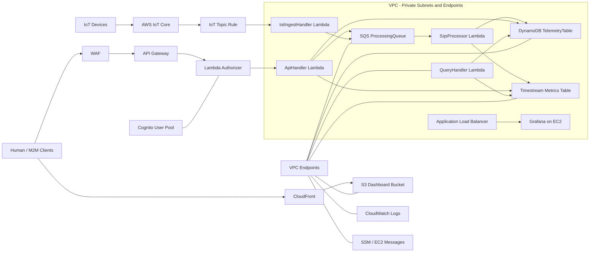

# Device Telemetry SaaS Platform

**Architecture, Deployment & Testing Guide**  
*AWS Cloud & Platform Engineering*  

**Version 1.0 | June 2026**

---

## Overview

The **Device Telemetry SaaS Platform** is a fully serverless, event-driven AWS architecture. It supports:

- A REST API for human users and M2M clients.
- An MQTT ingestion path for IoT devices.
- A shared processing pipeline that stores data in DynamoDB and Amazon Timestream.
- A custom dashboard and Grafana-based observability layer.

---

## Technology Stack

| Layer | Technology | Purpose |
|---|---|---|
| Ingestion (IoT) | AWS IoT Core + X.509 | Device MQTT connectivity |
| Ingestion (API) | API Gateway + Cognito | Human & M2M REST ingestion |
| Auth | Cognito + Lambda Authorizer | JWT validation for all API calls |
| Processing | Lambda + SQS | Async event processing |
| Metadata Store | DynamoDB | Device events & processing status |
| Time-Series Store | Amazon Timestream | Metric trends & analytics |
| Frontend | S3 + CloudFront | Custom React dashboard |
| Monitoring | Grafana on EC2 + ALB | Production dashboards |
| Networking | VPC + Private Subnets + Endpoints | Zero-NAT secure serverless architecture |
| IaC | AWS CDK (TypeScript) | Full stack as code |

---

## 1. Architecture Overview

The platform uses two ingestion paths:

- **REST API** for human users and M2M clients.
- **MQTT** for IoT devices.

Both paths converge on the same processing pipeline, which writes raw and processed data to DynamoDB and metric data to Timestream.

### 1.1 Ingestion Paths

| Path | Protocol | Auth | Target |
|---|---|---|---|
| Human Users | HTTPS REST | Cognito ID Token (JWT) | `POST /devices` |
| M2M Clients | HTTPS REST | Cognito Access Token (OAuth2 client credentials) | `POST /devices` |
| IoT Devices | MQTT over TLS | X.509 Certificate | `devices/{deviceId}/telemetry` |

## **1.2 Architecture Diagram** 



### 1.3 Data Flow

```text
IoT Device (MQTT/X.509)
  |
  +-- IoT Core --> Topic Rule --> IoT Lambda
  |
  +-- DynamoDB (raw event)
  +-- SQS --> Processor Lambda
      |
      +-- DynamoDB (processed)
      +-- Timestream (metrics)

Human/M2M (JWT/HTTPS)
  |
  +-- API Gateway --> Lambda Authorizer --> API Lambda
  |
  +-- DynamoDB (raw event)
  +-- SQS --> Processor Lambda
      |
      +-- DynamoDB (processed)
      +-- Timestream (metrics)

Visualisation
  +-- Custom Dashboard (S3 + CloudFront)
  +-- Grafana (EC2 private subnet + ALB)
```

### 1.4 Networking

All compute runs inside a VPC with private isolated subnets. AWS service calls use VPC endpoints to eliminate NAT Gateway costs and remove the internet as a failure point.

| Endpoint | Type | Service |
|---|---|---|
| DynamoDB | Gateway (free) | DynamoDB reads/writes |
| S3 | Gateway (free) | S3 reads/writes |
| SQS | Interface | Queue operations |
| Timestream Ingest | Interface | Write metrics |
| Timestream Query | Interface | Read metrics for dashboard |
| CloudWatch Logs | Interface | Lambda log delivery |
| SSM / SSM Messages / EC2 Messages | Interface | Session Manager access |

### 1.5 Security Layers

| Layer | Control | Detail |
|---|---|---|
| Edge | WAF + Managed Rules | AWSManagedRulesCommonRuleSet + IP rate limit 300 req/5min |
| API | API Gateway throttling | 100 req/s stage limit, 50 req/s on `POST /devices` |
| Auth | Lambda Authorizer | Validates both ID tokens (users) and access tokens (M2M) |
| IoT | X.509 certificates | Per-device certs, scoped IoT policy |
| Network | Private subnets | No public IPs on Lambda or EC2 |
| Access | SSM Session Manager | No SSH, no bastion, no keypairs |

---

## 2. Prerequisites

### 2.1 Local Tools

| Tool | Version | Install |
|---|---|---|
| Node.js | 20.x+ | https://nodejs.org |
| AWS CDK | 2.x+ | `npm install -g aws-cdk` |
| AWS CLI | 2.x+ | https://aws.amazon.com/cli |
| Python | 3.9+ | https://python.org |

### 2.2 AWS Account Requirements

- AWS account with programmatic access configured.
- IAM user or role with AdministratorAccess, or equivalent CDK deploy permissions.
- CDK bootstrapped in the target region:

```bash
cdk bootstrap aws://ACCOUNT_ID/us-east-1
```

---

## 3. Repository Structure

```text
device-telemetry-saas/
├── bin/
│   └── device-telemetry-saas.ts      # CDK app entry point
├── lib/
│   └── device-telemetry-saas-stack.ts # Full CDK stack
├── lambda/
│   ├── api/index.js                  # POST /devices ingest
│   ├── processor/index.js            # SQS processor
│   ├── iot/index.js                  # IoT Core ingest
│   ├── authorizer/index.js           # JWT Lambda authorizer
│   └── query/index.js                # GET /metrics Timestream query
├── frontend/
│   └── index.html                    # Custom dashboard SPA
├── grafana-artifacts/
│   ├── grafana-11.1.0-1.x86_64.rpm   # Grafana installer
│   └── plugins/                      # Timestream plugin
├── scripts/
│   ├── test-auth.sh                  # Auth test script
│   ├── test-iot.py                   # IoT MQTT test
│   ├── test-throttle.py              # Throttle test
│   ├── deploy-frontend.sh            # Frontend deploy
│   └── provision-grafana.py          # Grafana dashboard provisioner
├── package.json
└── cdk.json
```

---

## 4. Deployment Guide

### Step 1: Clone and Install

```bash
git clone <repo-url>
cd device-telemetry-saas
npm install
```

### Step 2: Configure AWS Credentials

```bash
aws configure
aws sts get-caller-identity
```

### Step 3: Bootstrap CDK

```bash
cdk bootstrap
```

### Step 4: Prepare Grafana Artifacts

Follow the Grafana preparation steps before deployment.

### Step 5: Synthesise and Deploy

```bash
cdk synth
cdk deploy
```

Deployment takes approximately 15–20 minutes.

### Step 6: Note Stack Outputs

| Output Key | Description |
|---|---|
| TelemetryApiEndpoint | API Gateway base URL |
| UserPoolId | Cognito User Pool ID |
| UserPoolClientId | Cognito app client ID for human users |
| DeviceClientId | Cognito M2M client ID |
| CognitoDomain | Cognito hosted UI domain |
| IotThingName | IoT Thing name (`demo-device-001`) |
| IotCertificatePem | Device X.509 certificate |
| IotPrivateKey | Device private key |
| MetricsApiEndpoint | Timestream query endpoint |
| DashboardUrl | CloudFront dashboard URL |
| GrafanaAlbUrl | Grafana ALB URL |
| GrafanaInstanceId | EC2 instance ID for SSM access |

### Step 7: Deploy Frontend Dashboard

```bash
chmod +x scripts/deploy-frontend.sh
./scripts/deploy-frontend.sh
```

This script:

1. Fetches stack outputs automatically.
2. Uploads `index.html` to S3.
3. Sets the CloudFront default root object.
4. Invalidates the CloudFront cache.

### Step 8: Provision Grafana Dashboard

```bash
python3 -m venv .venv
source .venv/bin/activate
pip install requests
python3 scripts/provision-grafana.py
```

Grafana is accessible via the ALB URL on port 80.

---

## 5. Testing Guide

### 5.1 Authentication Test

This verifies human user auth, M2M auth, and unauthenticated rejection.

```bash
chmod +x scripts/test-auth.sh
./scripts/test-auth.sh
```

Expected output:

```text
[4/6] Testing human user authentication...
✓ Human user authenticated
[5/6] Testing M2M device authentication...
✓ M2M device authenticated
[6/6] Testing API calls...
✓ Human user (ID token) -> 202 {"message":"Telemetry accepted"}
✓ M2M device (access token) -> 202 {"message":"Telemetry accepted"}
✓ Unauthenticated request correctly rejected -> 401
```

### 5.2 IoT Core MQTT Test

This simulates a physical device publishing telemetry via MQTT over TLS using X.509 certificate authentication.

```bash
source .venv/bin/activate
pip install awsiotsdk
python3 scripts/test-iot.py
```

Expected output:

```text
[3/4] Fetching IoT endpoint...
✓ Endpoint: xxxxxx-ats.iot.us-east-1.amazonaws.com
[4/4] Publishing telemetry...
✓ Connected to IoT Core
✓ Message 1/3 published -> devices/demo-device-001/telemetry
✓ Message 2/3 published -> devices/demo-device-001/telemetry
✓ Message 3/3 published -> devices/demo-device-001/telemetry
✓ Disconnected cleanly
```

### 5.3 API Throttle Test

This fires 50 concurrent requests to verify WAF rate limiting and API Gateway throttling.

```bash
source .venv/bin/activate
python3 scripts/test-throttle.py
```

Expected result: a mix of `202` and `429` responses, showing throttling is active.

### 5.4 Timestream Verification

```bash
aws timestream-query query \
  --region us-east-1 \
  --query-string "SELECT * FROM telemetry_ts.metrics WHERE time > ago(1h) ORDER BY time DESC LIMIT 20"
```

### 5.5 DynamoDB Verification

```bash
aws dynamodb get-item \
  --table-name <TABLE_NAME> \
  --key '{"deviceId":{"S":"DEV-001"},"timestamp":{"S":"<TIMESTAMP>"}}'
```

### 5.6 SSM Access to Grafana EC2

```bash
aws ssm start-session \
  --target $(aws cloudformation describe-stacks \
  --stack-name DeviceTelemetrySaasStack \
  --query "Stacks.Outputs[?OutputKey=='GrafanaInstanceId'].OutputValue" \
  --output text) \
  --region us-east-1
```

---

## 6. Lambda Functions

| Function | Trigger | Responsibilities |
|---|---|---|
| ApiHandler | API Gateway POST `/devices`, GET `/metrics`, SQS | Ingest telemetry, query Timestream, process SQS batch |
| IotIngestHandler | IoT Core Topic Rule | Ingest MQTT telemetry from IoT devices |
| AuthorizerHandler | API Gateway TOKEN authorizer | Validate Cognito ID tokens and M2M access tokens |
| SqsProcessor | SQS event source | Update DynamoDB with processed status, write Timestream |
| QueryHandler | API Gateway GET `/metrics` | Execute Timestream queries for dashboard |

All Lambdas run in private isolated subnets and use VPC endpoints for AWS SDK calls.

---

## 7. Dashboards

### 7.1 Custom Dashboard

This is a single-page React application served via CloudFront and authenticated against Cognito.

| Panel | Description |
|---|---|
| Stat Cards | Total devices, online count, avg temperature, active alerts |
| Metric Trends | Line chart with 1H/24H/7D toggle for temperature and humidity |
| Device Registry | Table with last-seen status and metric chips |
| Alert Log | CRITICAL/WARN entries for threshold breaches |

### 7.2 Grafana Dashboard

Grafana runs on a private EC2 instance behind an Application Load Balancer using the Timestream datasource plugin.

| Panel | Type | Query |
|---|---|---|
| Avg Temperature | Stat | Last value from Timestream |
| Avg Humidity | Stat | Last value from Timestream |
| Active Devices | Stat | COUNT DISTINCT deviceId in last 5 minutes |
| Temperature Alerts | Stat | COUNT where temperature > 28 C in last 1 hour |
| Temperature by Device | Time Series | AVG per device binned by 1 minute |
| Humidity by Device | Time Series | AVG per device binned by 1 minute |
| Device Registry | Table | Last known temperature, humidity, and last seen |
| Breach History | Time Series | Readings above the threshold |

---

## 8. Alert Thresholds

| Metric | Warning | Critical |
|---|---|---|
| Temperature | > 25 C | > 28 C |
| Humidity | > 60% | > 70% |
| Device offline | Not seen in 5 minutes | Not seen in 15 minutes |
| Lambda errors | 5 errors in 2 periods | CloudWatch Alarm triggers |

---

## 9. Scaling Considerations

### 9.1 Ingestion Layer

- API Gateway scales automatically.
- Lambda scales horizontally with zero configuration.
- IoT Core handles large fleets of device connections.
- SQS buffers spikes and reduces backpressure.

### 9.2 Data Layer

- DynamoDB PAY_PER_REQUEST avoids capacity planning.
- Timestream is suited to high-throughput metric ingestion.
- Global deployments can use DynamoDB Global Tables and Route 53 latency routing.

### 9.3 Multi-Tenancy

- API Gateway usage plans can isolate quotas by customer.
- WAF rate rules protect against noisy tenants.
- Cognito resource servers can scope M2M tokens per client.

### 9.4 Device Onboarding

- AWS IoT Fleet Provisioning for zero-touch certificate issuance.
- IoT Device Defender for anomaly detection.
- IoT Jobs for firmware updates.

---

## 10. Teardown

```bash
cdk destroy
```

This deletes all resources, including DynamoDB data and Timestream metrics.

```bash
aws ec2 describe-vpcs --filters Name=tag:Name,Values=DeviceTelemetrySaasStack/AppVpc
aws ec2 delete-vpc --vpc-id <VPC_ID>
```